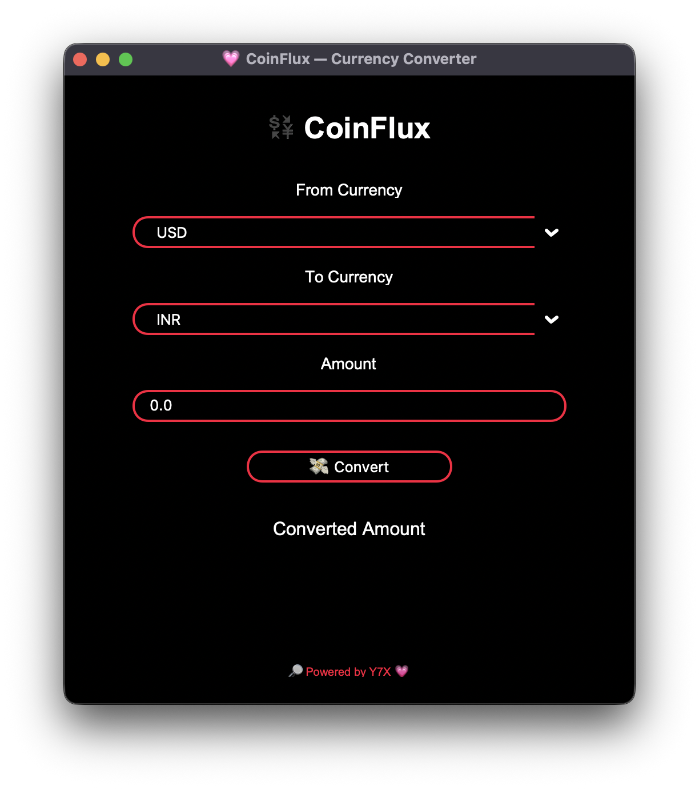

<div align="center">

# 💱 CoinFlux  
**🧊 Sleek, sharp & pitch black — meet CoinFlux**

A Clean & Curvy Currency Converter — Made with 💗 by Y7X



</div>

---

## 🌟 Features at a Glance

- 🌑 **True AMOLED UI** — all black everything
- 🎨 **White Text + Red Outlines**
- 🧊 **Pill-Shaped Inputs & Buttons**
- 🌍 **Live Currency Conversion**
- ⚡ **Instant Results with 1-Click Convert**

---

## 🖥️ Installation

> Python 3.9 or later required

```bash
git clone https://github.com/Y7X-bit/CoinFlux.git
cd CoinFlux
pip install -r requirements.txt
python CoinFlux.py